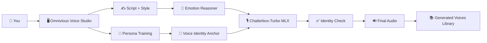

# 🎬 Omnivious Voice Studio: The Fun, Non-Technical, "Tell-Your-Friends" Edition

> A colorful tour of how your app turns raw voice clips into emotional, dramatic, spicy, and very listenable AI speech.

---

## 🌈 What Is Omnivious (In Human Words)?
Think of Omnivious Voice Studio as a **voice acting studio in your laptop**.

You give it:
- 🎤 a sample voice (upload or YouTube),
- ✍️ some text,
- 🎭 a mood/style,

and it gives you:
- 🔊 a generated voice that still sounds like the original person,
- 😢😄🎬 different emotional flavors,
- 📚 a library of your generated clips.

Basically: **same voice, different vibes**.

---

## 🧠 The Big Idea (No Nerd-Speak)
Omnivious does 4 major things:

1. **Learns the voice** from your source audio.
2. **Figures out emotion/style cues** from your script.
3. **Speaks in that style** with the trained voice persona.
4. **Checks identity quality** so style does not totally derail the original voice.

It is like telling an actor:
> “Read this line as sad, but still sound like *you*, not like a random soap opera ghost.”

---

## 🎪 The 6 Voice Styles (Now With Extra Drama)
- 😌 **Natural**: calm, normal, punctuation-respecting, no extra theatrics.
- 📰 **News**: authoritative, confident, slightly intimidating TV energy.
- 🎥 **Drama and Movie**: emotional rollercoaster mode. Whisper here, boom there.
- 😭 **Sad**: grief, sobby breath, heartbreak energy.
- 🤪 **Happy**: bubbly, giggly, playful, caffeinated sunshine.
- 💋 **Charming and Attractive**: flirtatious, smooth, teasing, trying to impress.

Yes, this is exactly where people test one script in all styles and laugh for 20 minutes.

---

## 🛠️ What Happens Behind the Curtain
### 1) Voice Persona Training
- You upload audio or a YouTube link.
- App grabs up to **5 minutes** max.
- It cleans/normalizes audio.
- It picks a **clean anchor clip** (target around **45 seconds**).
- It stores identity data so later output sounds like the same person.

### 2) Script Styling
- A local reasoning model reads your script in two passes:
  - pass 1: understand emotional shape,
  - pass 2: add safe voice-expression tags in smart spots.
- Only supported tags are used (no random chaos tags).

### 3) Voice Generation
- Chatterbox-Turbo MLX generates speech.
- Speed setting is applied.
- Identity checks run.

### 4) Quality Guardrails
If style gets too wild and voice identity drops, Omnivious Voice Studio retries with calmer settings.

Because yes, we want “cinematic sadness,” not “who is this person and why are they speaking from a cave.”

---

## 🎯 Why This Design Is Actually Smart
- ✅ **Fast local workflow**: no cloud dependency drama.
- ✅ **Identity-first logic**: style is important, but the voice should still be recognizably yours.
- ✅ **Progress bars everywhere**: no guessing if app is frozen.
- ✅ **Built-in cleanup**: old outputs auto-expire after retention window.
- ✅ **Persona manager**: select, rename, retrain, delete.

This is less “demo toy” and more “usable creative workstation.”

---

## 📦 In-App Experience (Simple Tour)
### Step 1: Train Persona
- Name your persona.
- Add source audio.
- Hit train.
- Watch progress bar.

### Step 2: Pick Style + Speed
- Choose mood from the 6 style cards.
- Set speed.

### Step 3: Generate
- Click generate.
- Watch progress + status.
- Play/download from generated library.

### Step 4: Iterate Like a Director
- Change style.
- Regenerate.
- Compare outputs.
- Pretend you’re running a tiny Pixar studio.

---

## 🖼️ Visual: "How Stuff Flows"

---

## 🎨 Mood Meter (Totally Scientific)
| Style | Emotional Intensity | Chaos Level | Boardroom-Safe? |
|---|---:|---:|---:|
| Natural | 2/10 | 1/10 | ✅ |
| News | 5/10 | 2/10 | ✅ (if your board likes confidence) |
| Drama and Movie | 10/10 | 8/10 | ❌ (unless your board is Netflix) |
| Sad | 8/10 | 4/10 | ⚠️ |
| Happy | 9/10 | 7/10 | ⚠️ (depends on caffeine level) |
| Charming and Attractive | 7/10 | 6/10 | ⚠️ (HR may ask questions) |

---

## 😂 Light Joke Break
- “News style” can sound like a press conference where every sentence is a headline.
- “Drama and Movie” can escalate faster than cable news on election night.
- “Charming and Attractive” is basically: “Trust me, this product pitch will close.”
- And yes, if you run the same line in all styles, one of them will sound like it belongs at a Trump rally, one at a rom-com audition, and one in a tragic season finale.

---

## 🧯 Important Non-Technical Bits (Still Important)
- The app prefers **voice consistency** over maximum style chaos.
- If the model can’t keep identity stable, it retries/falls back.
- Bad/noisy training audio = weaker cloning.
- Better source audio = way better output.

Pro tip:
- Use clean speech,
- avoid loud background music,
- keep source understandable,
- retrain persona when results drift.

---

## 🚀 What This Means for Non-Technical Teams
Omnivious Voice Studio is great for:
- social media voiceovers,
- product demos,
- storytelling content,
- localized style experiments,
- voice persona prototyping.

You get speed, style variety, and repeatability without opening a DAW or hiring a whole post-production pipeline.

---

## 🎉 Final Take
Omnivious Voice Studio is basically:
- part voice lab,
- part acting coach,
- part quality inspector,
- and part chaos manager.

And somehow, it works.

If the technical doc is the blueprint,
this one is the movie trailer.

**Roll credits. 🍿**
