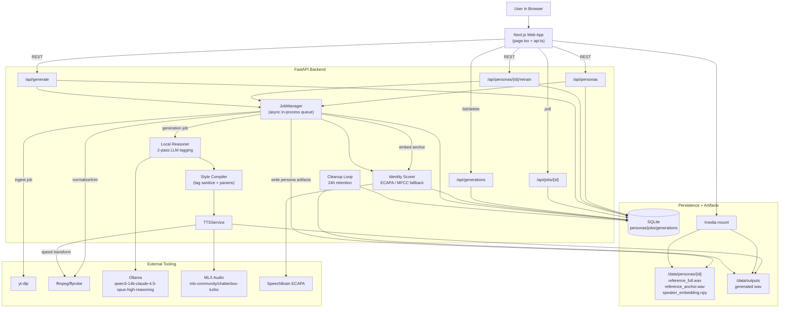

# Omnivious Voice Studio: Technical Requirements and System Design

## 1. Why This Exists (and Why It Is a Little Ambitious)
Omnivious Voice Studio is a local-first voice persona platform that lets a user:
- train a reusable voice persona from an upload or YouTube source,
- generate expressive speech with style controls,
- preserve speaker identity while style/emotion is layered on top,
- and manage generated assets without leaving the app.

In plain terms: same voice, many moods, minimal operational pain.

---

## 2. Product Scope
### 2.1 In Scope
- Persona training from:
  - local upload, or
  - YouTube URL.
- Training input capped to first **300s** (5 minutes).
- Persona identity artifacts:
  - full normalized reference clip,
  - anchor conditioning clip,
  - speaker embedding.
- TTS generation using **Chatterbox-Turbo MLX**.
- Style-first output (`natural`, `news`, `drama_movie`, `sad`, `happy`, `charming_attractive`) plus speed.
- LLM-assisted 2-pass script tagging with allowed native tags only.
- Identity-gated generation with retry and fallback behavior.
- Generation history, playback, delete, and auto-expiry cleanup.
- Local single-node deployment (Apple Silicon target).

### 2.2 Out of Scope
- Distributed queue/workers.
- Multi-user auth/tenant isolation.
- Cloud object storage and CDN.
- Full SSML authoring/editor.
- Model weight fine-tuning.

---

## 3. Functional Requirements
### FR-1 Persona Creation
The system shall:
1. Accept `persona_name` + `source_type` (`upload|youtube`).
2. Auto-version duplicate names (`Name`, `Name v2`, `Name v3`, ...).
3. Normalize audio to mono 24kHz WAV.
4. Trim training source to max 300s.
5. Persist persona metadata and training progress.

### FR-2 Persona Training Pipeline
The system shall:
1. Extract a clean anchor clip for conditioning.
2. Target conditioning anchor length ~**45s**, bounded by config.
3. Compute and store speaker embedding.
4. Expose progress phases and errors through job polling.

### FR-3 Persona Management
The system shall support:
1. list personas,
2. rename persona,
3. retrain persona,
4. delete persona and associated generation assets.

### FR-4 Style-Driven TTS Generation
The system shall:
1. accept persona + text + style + speed,
2. run optional LLM 2-pass tagging,
3. compile style with safe native tags,
4. synthesize with Chatterbox-Turbo,
5. apply speed transform,
6. run identity scoring and retry/fallback when needed,
7. persist generation diagnostics and output.

### FR-5 Job and Progress Observability
The system shall:
1. expose `queued|running|completed|failed`,
2. expose progress fraction [0..1],
3. keep user-facing errors concise.

### FR-6 Generated Asset Library
The system shall:
1. list generated clips,
2. play clips in UI,
3. delete individual clips,
4. auto-prune stale clips after retention threshold.

---

## 4. Technical Design
## 4.1 Architecture Overview
- Frontend: **Next.js (App Router, client-side polling)**
- Backend: **FastAPI**
- DB: **SQLite**
- Artifact storage: Local filesystem under `/data`
- TTS backend: `mlx-community/chatterbox-turbo`
- Identity scoring: ECAPA (with MFCC fallback)
- Local reasoner: Ollama model for 2-pass emotional tag planning

Key implementation paths:
- `apps/web/app/page.tsx`
- `apps/api/app/main.py`
- `apps/api/app/jobs.py`

## 4.2 Core Backend Components
### API Layer
- FastAPI endpoints for personas, jobs, generation, styles, tags, health.
- Static media mount via `/media` for local artifacts.

### Job Orchestrator
- In-process async scheduling in `JobManager`.
- Two job classes:
  - `persona_ingest`
  - `tts_generation`
- Progress updates are pushed into DB and polled by UI.

### Ingestion + Persona Trainer
- Source ingest:
  - Upload temp file or YouTube audio download (`yt-dlp` fallback strategy).
- Audio prep:
  - ffmpeg normalize (mono, 24k, max 300s).
- Anchor extraction:
  - speech-heavy segment scoring with duration penalty and clipping checks,
  - target ~45s conditioning clip.
- Speaker embedding:
  - ECAPA embedding persisted as `.npy`.

### Style Compiler
- Converts style + text into:
  - sanitized text,
  - bounded speech tags,
  - model generation params.
- Uses safe tag allowlist only: `[laugh]`, `[chuckle]`, `[sigh]`, `[gasp]`.

### Local Reasoner (LLM)
- Pass 1: understand script emotional structure.
- Pass 2: place tags conservatively without semantic rewrite.
- Strict JSON parsing + sanitization + chunking for long input.

### TTS Engine Adapter
- `TTSService` wraps MLX backend.
- `ChatterboxTurboEngine` loads model and synthesizes chunked output.
- Thread lock around generation protects model state.
- Speed handled post-synthesis via ffmpeg `atempo` with numpy fallback.

### Identity Gate
- Compares generated audio embedding against persona embedding.
- Strict mode thresholds:
  - pass >= 0.73,
  - min acceptable >= 0.65,
  - below min -> natural fallback attempt,
  - still below min -> fail job.

## 4.3 Data Model
### `personas`
- identity and source metadata,
- artifact paths (`reference_full.wav`, `reference_anchor.wav`, embedding),
- training state/progress/error,
- source and consumed durations,
- quality JSON.

### `jobs`
- generic async operation tracking (`payload_json`, `result_json`, progress, status).

### `generations`
- input/processed text,
- style/engine,
- identity score and retry data,
- applied tags and attempt diagnostics,
- output path and status.

Migration strategy:
- startup SQLite migration helper adds missing columns in-place.

---

## 5. Functional Walkthrough (End-to-End)
## 5.1 Persona Training Flow
1. User submits name + source.
2. API persists persona row (queued) and creates ingest job.
3. Job downloads/extracts audio, normalizes and trims.
4. Trainer computes quality metrics and picks best anchor clip.
5. Embedding generated and persisted.
6. Persona marked `completed`, UI refreshes list and status.

## 5.2 Generation Flow
1. User selects persona, style, speed, enters text.
2. API creates generation row and generation job.
3. Job runs LLM tagging (degrades gracefully if unavailable).
4. Style compiler finalizes text + params.
5. TTS engine synthesizes audio.
6. Identity score check:
   - pass: save output,
   - low score: retry with reduced style strength,
   - too low: fallback naturalization,
   - still too low in strict mode: fail with actionable message.
7. Completed clip is listed in library and playable.

---

## 6. Design Choices and Why They Were Made
## 6.1 Chatterbox-Turbo MLX as Primary Engine
Why:
- strong Apple Silicon local story,
- native tag support useful for expressive control,
- lower operational friction vs multi-model orchestration.

Tradeoff:
- style control still depends on prompting + tag strategy; not absolute prosody control.

## 6.2 In-Process Job Queue
Why:
- minimal infra, fast local iteration, fewer moving parts.

Tradeoff:
- no durability/throughput guarantees of external queue systems.

## 6.3 Identity-Gated Retry Policy
Why:
- protects the core product promise: style should not destroy voice identity.

Tradeoff:
- strict mode can fail some highly stylized outputs; fast mode exists for practical fallback.

## 6.4 Two-Pass LLM Tagging + Deterministic Compiler
Why:
- LLM provides contextual emotional cue placement.
- deterministic compiler enforces safety, tag budget, and predictable output envelope.

Tradeoff:
- extra latency and occasional LLM degradation path (handled with fallback).

## 6.5 Local Filesystem + SQLite
Why:
- dead simple local deployment.
- easy inspection/debugging of artifacts.

Tradeoff:
- no built-in distributed consistency or large-scale horizontal scaling.

---

## 7. Orchestration: Who Calls What and When
The control plane is API + JobManager. The data plane is media files + model inference.

- `main.py` accepts user request and records a job.
- `jobs.py` drives step transitions and progress updates.
- `persona_service.py` and `ingest.py` do training-side heavy lifting.
- `local_reasoner.py` + `style_compiler.py` prepare expressive script.
- `tts_service.py` + `chatterbox_turbo_engine.py` synthesize waveform.
- `speaker_identity.py` verifies identity confidence.
- frontend polls `/api/jobs/{id}` and updates progress UI.

If you like clean mental models: API is the traffic cop, JobManager is the stage manager, model backends are the performers.

---

## 8. Non-Functional Requirements (Important Stuff That Keeps This Alive)
## 8.1 Performance
- Startup must hard-fail early if model cannot load (fail fast beats mystery behavior).
- Generation should provide progressive feedback via job progress.
- Long text is chunk-aware in reasoning and synthesis paths.

## 8.2 Reliability
- Explicit error propagation into job status and persona status.
- Safe file cleanup on deletion and timed pruning.
- Retry and fallback paths for both style and identity conflict handling.

## 8.3 Safety and Content Constraints
- Tag allowlist only; disallowed tags are removed.
- No SSML or arbitrary tag injection from users.
- “Charming” style kept non-explicit by design intent.

## 8.4 Maintainability
- backend modular split by concerns (ingest, jobs, style, tts, identity).
- schema and runtime contracts represented with Pydantic types.
- startup migrations prevent schema drift in local installs.

## 8.5 Operability
- `/api/health` surfaces model and LLM readiness.
- generated artifacts are inspectable under `/data`.
- retention policy configurable by environment variables.

## 8.6 Security (Local Deployment Assumptions)
- no auth layer today; assume trusted local environment.
- CORS restricted to local dev origins by default.
- subprocess dependencies (`ffmpeg`, `yt-dlp`) must be controlled in host environment.

---

## 9. Detailed System Design Visual

---

## 10. API Contract Summary
### Personas
- `POST /api/personas`
- `GET /api/personas`
- `GET /api/personas/{id}`
- `PATCH /api/personas/{id}`
- `DELETE /api/personas/{id}`
- `POST /api/personas/{id}/retrain`

### Jobs
- `GET /api/jobs/{id}`

### Generation
- `POST /api/generate`
- `GET /api/generations`
- `GET /api/generations/{id}`
- `DELETE /api/generations/{id}`

### Catalog/Health
- `GET /api/styles`
- `GET /api/tags`
- `GET /api/health`

---

## 11. Configuration Cheatsheet
Important runtime variables:
- `OMNIVIOUS_DATABASE_URL`
- `OMNIVIOUS_CORS_ORIGINS`
- `OMNIVIOUS_TTS_RETENTION_HOURS`
- `OMNIVIOUS_CLEANUP_INTERVAL_SECONDS`
- `OMNIVIOUS_CLONE_CONDITION_TARGET_SECONDS` (default `45`)
- `OMNIVIOUS_CLONE_CONDITION_MIN_SECONDS` (default `20`)
- `OMNIVIOUS_CLONE_CONDITION_MAX_SECONDS` (default `60`)
- `OMNIVIOUS_OLLAMA_BASE_URL`
- `OMNIVIOUS_OLLAMA_REASONING_MODEL`
- `OMNIVIOUS_OLLAMA_REASONER_TIMEOUT_SECONDS`
- `OMNIVIOUS_OLLAMA_TAGGING_CHUNK_CHARS`

---

## 12. Known Risks and Sharp Edges
- Strict identity mode may reject heavily stylized output if speaker similarity drops too far.
- In-process queue means one-node reliability profile; process death drops in-flight jobs.
- LLM tagging quality depends on local Ollama model availability and response quality.
- Heavy local model load can make startup and first inference slow on cold cache.

---

## 13. Future Upgrades (If You Want to Turn This Into a Beast)
1. Move jobs to Redis queue + worker pool for resilience.
2. Add auth + persona ownership boundaries.
3. Add objective audio quality scoring in generation pipeline.
4. Add optional per-style calibration profiles per persona.
5. Add storage abstraction (local/S3) and signed media URLs.
6. Add deterministic regression test corpus for style separation and identity fidelity.

---

## 14. Final Design Note
The central design philosophy is intentional tension management:
- style should be expressive,
- identity should remain recognizable,
- and operations should remain local-first and predictable.

Everything in this system (LLM tagging, style compiler budgets, identity gating, fallback policy) exists to keep that tension productive instead of chaotic.
