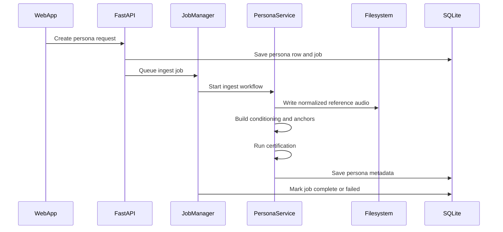
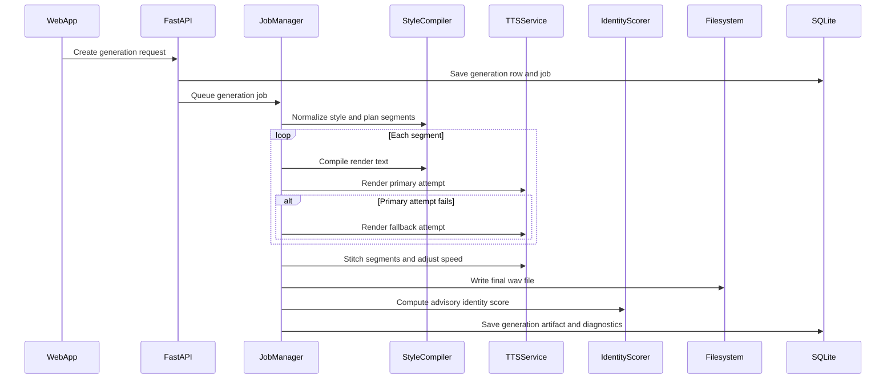

# Omnivious Voice Studio TRD

## Document Intent
This technical requirements document explains how Omnivious Voice Studio is built, why the system is shaped the way it is, what the key contracts are, and how the architecture remains extensible for future contributors.

It is written for:
- engineers
- maintainers
- technical product owners
- open source contributors
- reviewers who need architectural context

---

## 1. System Summary

Omnivious Voice Studio is a local-first voice persona application composed of:
- a Next.js frontend for workflow orchestration and playback
- a FastAPI backend for APIs, jobs, orchestration, and runtime control
- SQLite for metadata persistence
- local filesystem storage for persona assets and generation outputs
- MLX-based TTS backends for preview and final rendering
- local acoustic identity scoring for certification and advisory checks

Primary system goals:
- run locally on Apple Silicon
- avoid external inference APIs and token billing
- expose understandable state transitions
- preserve a clean extension surface for models, evaluators, and orchestration logic

---

## 2. Design Principles

### 2.1 Local First
The application is designed so the critical path does not depend on remote inference services.

Why:
- zero recurring API/token cost
- stronger privacy posture
- lower operational dependency surface
- simpler open source adoption

### 2.2 Explicit State Over Hidden Magic
Persona training, certification, and generation are modeled as jobs with visible progress.

Why:
- local ML work can take time
- state visibility reduces user confusion
- explicit states simplify debugging and retries

### 2.3 Quality Gating Before Generation
The system certifies personas before it allows generation.

Why:
- weak persona assets should fail early
- generation should not be the place where the user discovers the training asset is unusable
- this preserves the central promise of identity continuity

### 2.4 Opinionated but Extensible
The system provides a constrained product surface while leaving clear technical seams for extension.

Why:
- product simplicity improves usability
- technical modularity improves maintainability

---

## 3. Architecture Overview

```mermaid
flowchart TD
    web["Next Web App"] --> api["FastAPI API Layer"]
    api --> jobs["Job Manager"]
    api --> db["SQLite"]
    api --> files["Local Filesystem Data"]
    jobs --> ingest["Ingest And Normalization"]
    jobs --> persona["Persona Service"]
    jobs --> style["Style Compiler And Segment Planner"]
    jobs --> tts["TTS Service"]
    jobs --> identity["Identity Scorer"]
    tts --> preview["Preview Engine"]
    tts --> final["Final Engine"]
    persona --> files
    tts --> files
    identity --> files
    api --> cleanup["Retention Cleanup And Watchdog"]
```

### Why This Architecture
- the frontend remains thin and interaction-focused
- orchestration logic lives on the backend where progress, persistence, and failure handling can be centralized
- SQLite and filesystem storage keep the system simple and local
- the TTS and identity layers are separable from the API layer, improving extensibility

---

## 4. Major Components

| Component | Responsibility | Why It Exists |
| --- | --- | --- |
| Next.js frontend | UI workflows, polling, playback, user controls | Keeps product interaction responsive and simple |
| FastAPI app | API contracts, startup, job dispatch, media serving | Central application boundary |
| JobManager | Background ingest, certification, and generation execution | Gives async workflow semantics without adding external queue infra |
| Persona service | training, conditioning, anchor extraction, certification | Encapsulates persona lifecycle and quality gate logic |
| Style compiler | style normalization, text shaping, safe tag control, segmentation | Converts product-level style choices into renderable instructions |
| TTS service | backend initialization, model routing, synthesis, speed transform | Isolates engine-specific behavior behind one service |
| Identity scorer | embeddings, similarity, speech quality | Provides quality signals for certification and advisories |
| SQLite + SQLAlchemy | durable app state | Minimal local persistence layer |
| Filesystem under `data/` | audio, embeddings, outputs, local assets | Natural fit for local media-heavy workflows |

---

## 5. Frontend Design

### 5.1 Responsibilities
The frontend handles:
- persona creation form
- persona management actions
- generation controls
- progress polling
- output playback
- generated library browsing

### 5.2 Why the Frontend Is Thin
The frontend does not own core ML logic.

Why:
- backend orchestration needs durable job state
- certification and generation logic should not be duplicated across clients
- keeping the client thin makes future client variants easier

### 5.3 UI Surfaces
The current interface is organized into four product zones:
- Persona Training
- Persona Manager
- Style Controls + Generation
- Generated Voices

Why:
- the IA mirrors the mental model of the product lifecycle
- each zone corresponds to a stable domain concept in the backend

---

## 6. Backend Design

### 6.1 API Layer
The API exposes:
- health
- persona CRUD and lifecycle actions
- job polling
- generation creation and listing
- style/tag listing
- media serving

The backend also mounts local media from the data directory for in-app playback.

### 6.2 Startup Behavior
At startup, the backend:
- validates configuration
- ensures runtime directories exist
- creates database tables
- runs SQLite migration helpers
- attempts to warm both preview and final TTS engines asynchronously
- starts cleanup and watchdog tasks

Why:
- startup validation surfaces configuration issues early
- warming models at boot reduces first-render surprise
- migration-on-start keeps local upgrades simple

### 6.3 Why `@app.on_event` Is Still Present
The code currently uses FastAPI startup/shutdown events rather than a lifespan handler.

Why it likely remains:
- straightforward implementation
- sufficient for the current product stage

Tradeoff:
- FastAPI now warns that this pattern is deprecated
- migration to lifespan is a future maintainability improvement, but not a functional blocker

---

## 7. Data Model

## 7.1 `personas`
Core fields include:
- identity and source metadata
- audio asset paths
- training duration and source duration
- progress and error fields
- certification state and report
- render profile metadata
- anchor candidate data
- certified profile version

Why this shape:
- persona creation is not just a name and a file path
- the product needs enough metadata to explain quality, certification, and render behavior

## 7.2 `jobs`
Core fields include:
- job type
- status
- progress
- payload JSON
- result JSON
- error
- timestamps

Why this shape:
- the system needs generic async workflow tracking
- multiple domains reuse the same orchestration primitive

## 7.3 `generations`
Core fields include:
- persona association
- input and processed text
- style and engine metadata
- render mode
- fallback metadata
- warning codes
- identity score
- attempts and applied tags
- output path and duration
- final status

Why this shape:
- generation is a rich artifact, not just a WAV file
- diagnostics matter for transparency and future analytics

---

## 8. Core API Contracts

## 8.1 Persona Contracts
Key outputs expose:
- `training_status`
- `training_progress`
- `certification_status`
- `certification_report`
- `render_profile`
- anchor and conditioning paths

Why:
- the UI needs enough state to support decision-making, not just display names

## 8.2 Generation Contracts
Generation requests accept:
- `persona_id`
- `text`
- `style`
- `render_mode`
- `speed`
- optional `model_id`

Generation outputs expose:
- engine choice
- fallback usage
- segment count
- identity score
- warnings
- timing metadata

Why:
- the contract supports both simple product use and deeper debugging/analysis

## 8.3 Health Contract
The health endpoint reports:
- overall status
- startup state
- preview readiness
- final readiness
- active model ids

Why:
- local ML startup can fail in ways that should be diagnosable without guesswork

---

## 9. Runtime Orchestration

## 9.1 Persona Ingest Flow



### Why This Flow
- it cleanly separates API request handling from heavy local work
- job persistence makes progress polling possible
- certification is part of the same lifecycle so the persona reaches a decisive state

## 9.2 Certification Flow
Certification:
- uses the normalized source
- builds conditioning and anchor assets
- generates test renders across preview/final modes and styles
- computes identity similarity
- computes an operational ratio
- marks the persona `certified` or `rejected`

Why:
- a persona should be validated under realistic render conditions, not just static feature extraction

## 9.3 Generation Flow



### Why Segment-by-Segment Generation
- long-form text is more robust when split into bounded segments
- segment planning enables pause control and style modulation
- fallback logic can rescue individual segments instead of losing the whole generation

### Why Best-Effort Fallbacks Matter
The generation path is intentionally more tolerant than certification.

Why:
- certification is the gate
- generation should preserve useful work when possible
- users benefit from usable advisory-marked output more than from rigid hard-failure behavior in all cases

---

## 10. Component-Level Design Rationale

## 10.1 JobManager
The `JobManager` is an in-process orchestrator using asyncio tasks and a single-worker thread pool for generation work.

Why:
- minimal infrastructure
- easy local deployment
- enough control for the product's current concurrency needs

Tradeoffs:
- limited throughput
- no external durability guarantees
- not suitable for multi-node scale without redesign

## 10.2 Persona Service
The persona service owns:
- source acquisition
- normalization and trimming
- anchor extraction
- conditioning clip creation
- certification report generation

Why:
- persona logic is a coherent domain with specialized quality rules
- isolating it avoids spreading training semantics across API and jobs code

## 10.3 Style Compiler
The style compiler handles:
- style normalization
- safe tag sanitization
- punctuation shaping
- segment planning
- render parameter generation

Why:
- product-facing style should map to deterministic backend behavior
- a dedicated compiler is easier to evolve than ad-hoc branching inside generation code

## 10.4 TTS Service
The TTS service manages:
- backend initialization
- preview/final routing
- model alias resolution
- synthesis
- post-synthesis speed transform

Why:
- separates product orchestration from model backend details
- makes engine replacement easier

## 10.5 Acoustic Identity Scorer
The current scorer uses local acoustic features rather than an external service.

Why:
- zero recurring cost
- no external dependency
- deterministic and local

Tradeoff:
- this is a pragmatic identity layer, not a cloud-grade universal biometric verifier
- it is good enough for certification and advisory quality logic, but still extensible

---

## 11. Contracts and State Machines

## 11.1 Persona State
Training state values:
- `idle`
- `queued`
- `running`
- `completed`
- `failed`

Certification state values:
- `pending`
- `certifying`
- `certified`
- `rejected`
- `uncertified_legacy`

Why separate them:
- training progress and certification validity are related but distinct
- this helps the UI explain both operational and quality state

## 11.2 Job State
Job state values:
- `queued`
- `running`
- `completed`
- `failed`

Why generic job states:
- simpler orchestration surface
- reusable across ingest, certification, and generation

## 11.3 Generation Quality State
The API computes a quality state of:
- `pass`
- `warning`
- `hard_fail`

Why:
- the product needs a user-facing compression of deeper diagnostics

---

## 12. Persistence and Storage

### 12.1 SQLite
SQLite is used for:
- personas
- jobs
- generations

Why SQLite:
- zero external service requirement
- strong fit for local-first single-user workflows
- easy repo adoption and simple ops

### 12.2 Filesystem Layout
The `data/` directory holds:
- `omnivious.db`
- `jobs/`
- `models/`
- `outputs/`
- `personas/`

Why filesystem storage:
- audio assets, embeddings, and rendered outputs are naturally file-based
- local media tooling and playback integrate cleanly with a filesystem model

### 12.3 Startup Migrations
The backend performs lightweight SQLite column migrations at startup.

Why:
- simplifies upgrades for local installations
- avoids a heavier migration dependency for the current scale

Tradeoff:
- eventually a formal migration framework may be cleaner if schema churn increases

---

## 13. Extensibility

## 13.1 Adding New Styles
To add a new style, contributors can extend:
- style literals
- style catalog metadata
- allowed tags
- style defaults in render profiles
- UI style cards

Why this is extensible:
- style is a first-class domain concept with centralized mappings

## 13.2 Adding New TTS Backends
The backend abstraction makes it possible to add new render engines behind the TTS service.

Expected extension points:
- backend implementation in `app/tts/backends`
- model alias mapping
- engine initialization logic
- render routing policy

## 13.3 Replacing Identity Scoring
The identity scorer is an explicit service object.

Why this matters:
- a stronger embedding model can be integrated without rewriting the API surface
- evaluation logic remains swappable

## 13.4 Evolving Storage
The current system uses local filesystem + SQLite, but the boundaries are clear enough to evolve toward:
- object storage
- external databases
- distributed queues

Those are not current goals, but the system is not architecturally trapped.

---

## 14. Configuration Surface

The environment configuration exposes key runtime controls for:
- CORS
- database path
- retention and cleanup cadence
- preview and final model ids
- clone conditioning limits
- anchor limits
- certification thresholds
- timeout behavior
- segmentation behavior
- render token budgets
- reasoner-related settings
- identity thresholds

Why this matters:
- many important tradeoffs are tunable without changing code
- maintainers can adapt the stack to different hardware or quality preferences

The current configuration model is intentionally explicit rather than hidden inside code constants.

---

## 15. Evaluation, Verification, and Operability

## 15.1 Built-in Evaluation Concepts
The system already includes several quality signals:
- certification similarity threshold
- certification operational ratio threshold
- advisory identity drift warnings
- generation attempt logs
- warning codes
- render timing fields

Why this matters:
- a voice product without eval hooks becomes hard to trust and hard to improve

## 15.2 Verification Paths
Current verification assets include:
- backend pytest suite
- frontend production build
- smoke script for runtime recovery path
- benchmark utilities and reports

Why this matters:
- open source contributors need reproducible validation steps
- local ML products need confidence beyond "it worked once on my machine"

## 15.3 Health and Recovery
Operational support includes:
- health endpoint
- stale job recovery
- cleanup loop
- job watchdog loop

Why:
- local apps still need operational hygiene, especially around long-running jobs

---

## 16. Open Source and Local-First Tradeoffs

### Strengths
- zero recurring API/token cost
- privacy-conscious default architecture
- transparent code paths
- forkability and contributor friendliness

### Tradeoffs
- hardware-specific performance envelope
- slower cold-start behavior than hosted APIs
- higher local environment sensitivity
- current architecture is optimized for local single-node use, not scale-out service operation

These are intentional tradeoffs aligned with the product thesis.

---

## 17. Responsible AI Boundary

This TRD describes a powerful local system for synthetic voice generation. It does not remove the need for lawful and ethical use.

Engineering and product together should continue to preserve:
- explicit user responsibility messaging
- consent and misuse warnings in documentation
- a system posture that discourages deceptive or harmful use

Local execution is an implementation decision. Responsible use remains a human responsibility.

---

## 18. Why This Design Holds Together

The system works because the architectural choices are coherent with the product strategy:
- local-first runtime supports zero recurring cost
- open source implementation supports transparency and extensibility
- certification protects the product promise before generation
- segment-based orchestration improves long-form robustness
- explicit diagnostics improve trust
- simple persistence and in-process jobs reduce operational burden

In short, the design is not accidental. It is a deliberate alignment between:
- product goals
- hardware assumptions
- quality expectations
- contributor ergonomics
- user trust
